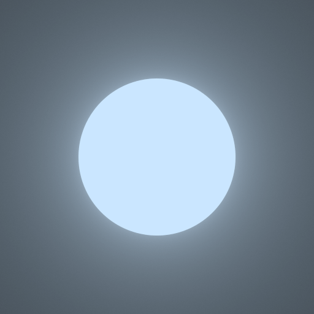

# Light 2D: Fast Ray Tracer in Python

This project implements a fast 2-D ray tracer in Python.

## Project Structure

The main ray tracer package is in the `light2d` folder.

* The `core` sub-package contains base class definitions and functions for rendering and saving images.
* The `shapes` sub-package contains subclasses of `Shape`. `Shape` represents the geometry of an entity, which has an axis-aligned bounding box and can be intersected by a ray.
* The `materials` sub-package contains subclasses of `Material`. `Material` represents the surface and internal properties of an entity's material, including scattering of rays, light intensities of emissive materials, and light attenuation within transparent materials.
* The `entities` sub-package contains subclasses of `Entity`. `Entity` represents a physical object consisting of shapes and materials. It can also represent a collection of smaller entities organized inside an acceleration structure.
* The `integrators` sub-package contains subclasses of `Integrator`. An `Integrator` is used to calculate the light intensities of pixels in the output image.

## Performance

This ray tracer uses several accelerating techniques, which makes its performance on par with many C/C++ implementations.

* *JIT compilation*. The entire ray tracer is JIT compiled by Numba and runs in Numba's `nopython` mode. This means the code runs natively without any involvement of the Python interpreter. Moreover, since most scene parameters are known at the time of JIT compilation, they are treated as constants by the JIT compiler, enabling more optimization possibilities.
* *Multiprocessing*. When multiprocessing is turned on, every rendered image is split into a grid of tiles, where each tile is rendered on a separated process. Multiprocessing typically makes rendering several times faster.
* *Acceleration structures*. The ray tracer implements several common acceleration structures like the k-d tree. They accelerate intersection tests significantly, especially when there are a lot of entities in the scene.

## Examples

The following code from `examples/hello_circle/hello_circle.py` renders a blue emissive circle. The scene is easily described in a concise, declarative syntax:

```python
film = light2d.render(
    entity=entities.SimpleEntity(
        shape=shapes.Circle(
            center=(0, 0),
            radius=1,
        ),
        material=materials.ConstantLight(
            li=(0.6, 0.8, 1.0),
        ),
    ),
    integrator=integrators.PathTracer(
        n_samples=16,
    ),
    region=((-2, -2), (2, 2)),
    film_size=(512, 512),
    n_tiles=6,
)
```

Output image:



See the `examples` folder for more examples of using the ray tracer.
